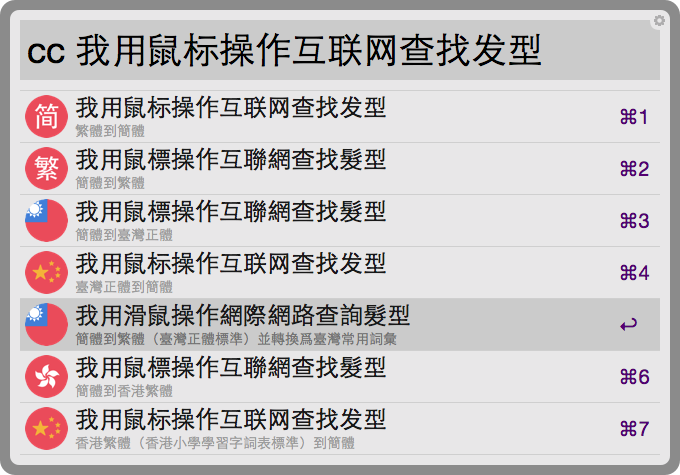

# Alfred Chinese Converter 簡繁轉換

[](https://waffle.io/amowu/alfred-chinese-converter) [](https://gitter.im/amowu/alfred-chinese-converter?utm_source=badge&utm_medium=badge&utm_campaign=pr-badge)


## Introduction 介紹

使用開源項目 [OpenCC](https://github.com/BYVoid/OpenCC)（開放中文轉換）開發的 [Alfred 2](http://www.alfredapp.com/) workflow，支持簡繁體中文的[詞彙級別轉換](https://zh.wikipedia.org/wiki/%E7%B9%81%E7%B0%A1%E8%BD%89%E6%8F%9B#.E8.A9.9E.E5.B0.8D.E8.A9.9E.E7.9B.B8.E4.BA.92.E8.BD.89.E6.8F.9B)、[異體字轉換](https://zh.wikipedia.org/wiki/%E7%B9%81%E7%B0%A1%E8%BD%89%E6%8F%9B#.E5.AD.97.E5.AF.B9.E5.AD.97.E7.9B.B8.E4.BA.92.E8.BD.AC.E6.8D.A2)以及[地區習慣用詞轉換](https://zh.wikipedia.org/wiki/%E7%B9%81%E7%B0%A1%E8%BD%89%E6%8F%9B#.E5.9C.B0.E5.8C.BA.E7.94.A8.E8.AF.AD.E8.BD.AC.E6.8D.A2)（中國大陸、臺灣、香港）。

## Features 特點

節選自 [OpenCC](https://github.com/BYVoid/OpenCC) 的部份特點：

> - 嚴格區分「一簡對多繁」和「一簡對多異」。
> - 完全兼容異體字，可以實現動態替換。
> - 嚴格審校一簡對多繁詞條，原則爲「能分則不合」。
> - 支持中國大陸、臺灣、香港異體字和地區習慣用詞轉換，如「裏」「裡」、「鼠標」「滑鼠」。
> - 詞庫和函數庫完全分離，可以自由修改、導入、擴展。

## Installation 安裝

Mac OS X 環境底下，使用 [Homebrew](http://brew.sh/) 安裝 [OpenCC](https://github.com/BYVoid/OpenCC) 這套開放中文轉換庫：

```bash
$ brew install opencc
```

## Download 下載

📎 [alfred-chinese-converter.alfredworkflow](https://github.com/amowu/alfred-chinese-converter/releases/download/1.0.0/alfred-chinese-converter.alfredworkflow) v1.0.0

## Usage 用法

使用關鍵字 `cc` 輸入需要作簡繁轉換的詞句：


Alfred 會列出 7 項轉換結果：

- 簡體到繁體
- 繁體到簡體
- 簡體到臺灣正體
- 臺灣正體到簡體
- 簡體到香港繁體（香港小學學習字詞表標準）
- 香港繁體（香港小學學習字詞表標準）到簡體
- 簡體到繁體（臺灣正體標準）並轉換爲臺灣常用詞彙



選擇其中一筆結果，自動複製至剪貼簿：


## License 許可協議

MIT License

## Third Party Library 第三方庫

- [alfred-python](https://github.com/nikipore/alfred-python) Apache License 2.0
- [opencc-python](https://github.com/lepture/opencc-python) Apache License 2.0

## Contributors 貢獻者

- [Michael Waterfall](https://github.com/mwaterfall/alfred-datetime-format-converter)
- [Khanh Ly](https://dribbble.com/shots/1948154-Country-flags-Retail-Loyalty-Congress-2015)